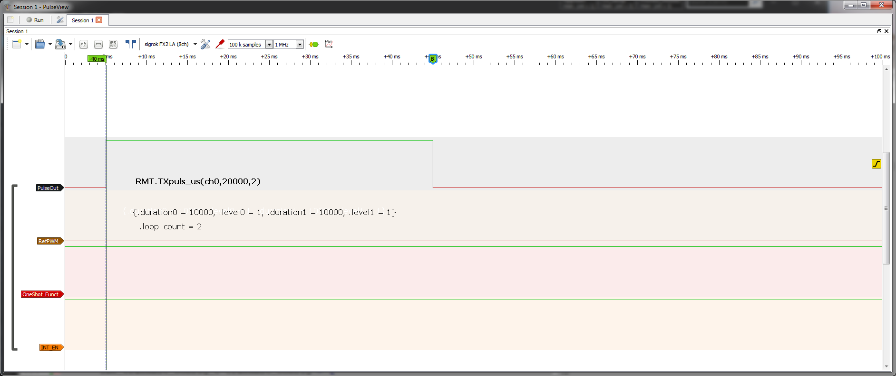
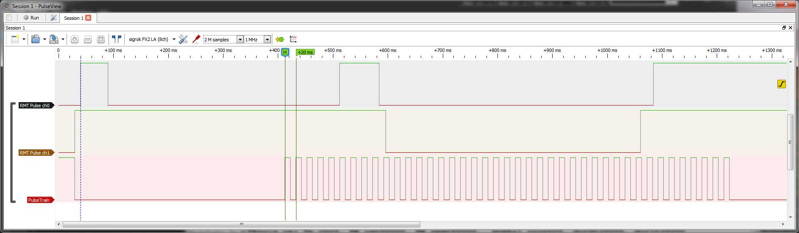
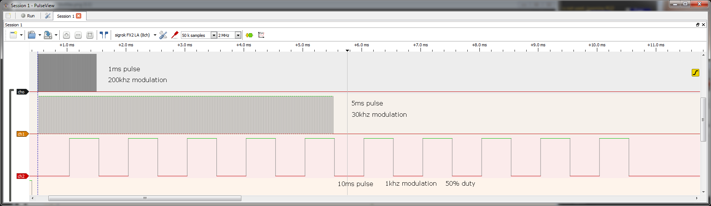
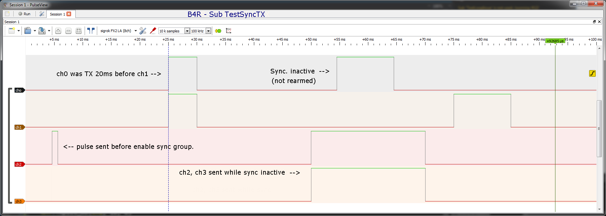
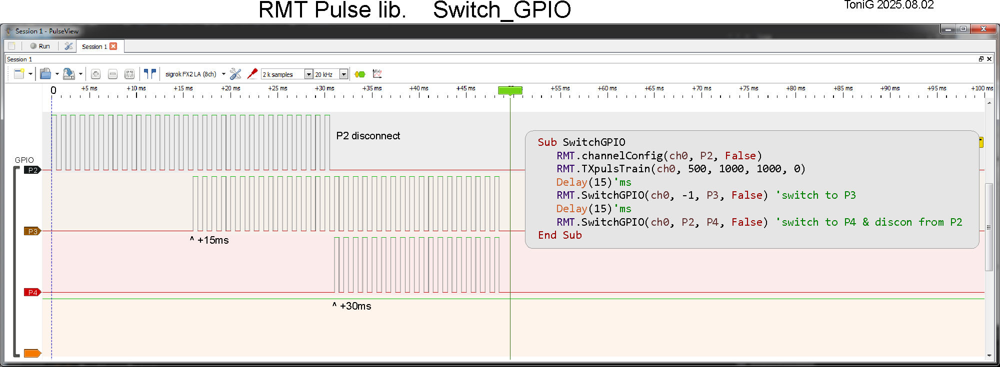

# ESP32 RMT Pulse Library for B4R 
&nbsp; &nbsp; &nbsp; &nbsp; &nbsp; &nbsp; &nbsp; **===== ( Pre-release ) =====**

**Date**: 2025.07.28  &nbsp; &nbsp; &nbsp; &nbsp; &nbsp; &nbsp; &nbsp;  **Author**: ToniG  
**Lib Version**: 0.90 &nbsp; &nbsp; &nbsp; &nbsp; &nbsp; &nbsp; &nbsp; **Doc Version**: 1.1 

---

## Introduction

This B4R Library enables using the ESP32 RMT module to produce pulse signals.  
It uses the ESP32 IDF API `rmt_tx` driver for channel config, memory symbol setting, and pulse TX.<br>
   IDF version &nbsp;  V5.2+ is required.

> ⚠️ This library is **not** a full implementation of RMT functionality.  
> It simply exploits the RMT module to generate pulses on GPIO pins with minimum complexity.

- Resolution is set to **1 µs** (1 tick) This is the minimum pulse width.
- Number of tx channels: [SOC dependent].
  ESP32 has **8**, ESP32s3 has **4**, ESP32c3 has **2**, ...
- Number of memory symbols: [SOC dependent].
  ESP32 has **64**, ESP32s3 has **48**, ESP32c3 has **48**, ...

To understand the RMT module in more detail, refer to the "Remote Control Peripheral (RMT)" section of the ESP-IDF documentation & the Technical Reference Manual.<br>
⚠️ Ensure to select the correct document for your SOC variant (e.g., ESP32, ESP32-S3, ...).   
Another helpful reference is [Circuit Labs - Chapter 141: RMT Module of ESP32](https://circuitlabs.net/rmt-remote-control-module-of-esp32)

---

## How the ESP32RMTpuls lib Works (Simplified)

From B4R:

1. Configure a RMT channel with:   Channel num,  GPIO pin,  Output invert.
2. Send a pulse with:     Channel num, Duration µs, Invert.
3. (optional) Apply PWM, GPIO routing, sync to the TX pulse.  

Lib internal(C++):

- The RMT module has internal RAM (384x32 for ESP32s3), each 32bit word is a memory symbol that defines a pair of TX out logic states - duration0, level0 & duration1, level1.  
  The symbols are sent sequentially to create a logic sequence waveform output.
- A memory symbol (`rmt_symbol_word_t`) is a 32-bit struct with:
  - `.duration0` (15 bits), `.level0` (1 bit)
  - `.duration1` (15 bits), `.level1` (1 bit)

Example:

```c
symbol0: .duration0 = 10, .level0 = 1, .duration1 = 5, .level1 = 1
symbol1: .duration0 = 0, .level0 = 0  // <-- end-marker
```

Results in a **15 µs one-shot pulse**.  
The following symbol with `.duration = 0` is used as a transmission **end-marker**.  

- Pulse Modulation (PWM) uses 2 16bit values to apply a high or low level to the pulse.  
  The sum of the 2 values is PWM frequency, the ratio of the 2 values is the PWM duty.  
  The RMT driver has some issues, so carrier registers are set using ESP register macro's.
- In ESP-IDF, there's an encoder that translates bit patterns to memory symbols — **not used** in this library.

---

## Example B4R Usage

Unzip the library **rESP32RMTpuls.zip** file to your 'AdditionalLibraries' B4R folder.  
In the Libraries Manager of B4R IDE select the library from the list. (R-clik Refresh if needed) 

```vbnet
Private RMT As ESP32RMTpuls           ' <-- Put this line in Process_Globals 
Private Const ch0 = 0, P2 = 2 As Byte '     (can replace "RMT" with your preference)

RMT.channelConfig(ch0, P2, False)     ' Setup RMT channel (RMT ch, GPIO pin, Invert out)
RMT.TXpuls_us(ch0, 15, 0)             ' 15 µs pulse (RMT ch, PW µs, loop count)
                                      ' Wait for a pulse to finish before starting a new pulse.
```

### Pulse Duration Limits and default values

- Minimum pulse width = 1µs
- One RMT symbol half (.duration) = up to 32767 µs (65534 for 1 symbol)
- 47 symbols = **3080098 µs max**  `or`  63 symbols = **4128642 µs max**
- With `Loop_cnt`, pulse duration can be multiplied up to 1023x:  
  → 3080098000 µs (3080.0 seconds) `or` 4128642000 µs (4128.6 seconds) <sup> (1)</sup>

```vbnet
RMT.TXpuls_us(ch0, 1, 0)             ' 1 µs pulse
RMT.TXpuls_us(ch0, 3145632, 1000)    ' ~52 min pulse
```

- RMT clk = APB_CLK (80mhz)

- RMT tick resolution = 1 µs<br>

- Pulse Modulation(PWM): frequency Min.= 650hz - Max.=20mhz, Duty scale=1000.  
  For freq. <  1221hz duty val will be clamped progressively < Duty max.  
  
  <p style="line-height: 140%; font-size: 13px;"> Note 1.<br> 
    1x tick(res=1µs) may be added (if .duration1=0) to each loop for glitch free looping </p>

## Looping Explained

- `Loop_cnt` multiplies pulse duration:
  
  - `0` or `1` = x1
  - `2` = x2, 10 = x10
  - `-1` = **infinite loop** (pulse remains active like `digitalWrite` HIGH)

- Max supported loop: **1023**  (RMT module limit -  register bitfield [RMT_TX_LOOP_NUM_CHn])

- To cancel an indefinite loop call StopPuls(Tx_ch), to send a new pulse first call channelConfig(Tx_ch, GPIOn, Pin_Inv)

---

## Library Function Calls

> It is recommended to define constants for RMT channels and GPIO pins:

```vbnet
'Example:
Private Const ch0 = 0, ch1 = 1, ch2 = 2, ch3 = 3 As Byte
Private Const P2 = 2, P3 = 3, P4 = 4 As Byte
```

### .channelConfig() - Configure RMT Channel

Setup channel ready for pulse data. 

```vbnet
RMT.channelConfig(ch0, P2, False)
'   channelConfig(byte Tx_ch, byte GPIO_n, bool Inv_out)
```

### .TXpuls_us() - Send Pulse (Microseconds)

Makes a pulse of microseconds duration. 1 to MAXµs<sup> (2)</sup>

```vbnet
RMT.TXpuls_us(ch0, 15000, 0)     ' 15 ms pulse
'   TXpuls_us(byte Tx_ch, ULong PW_us, int Loop_cnt)
```

### .TXpuls_ms() - Send Pulse (Milliseconds)

Makes a pulse of milliseconds duration. 1 to MAXms<sup> (2)</sup>

```vbnet
RMT.TXpuls_ms(ch0, 15, 0)        ' 15ms pulse
'   TXpuls_ms(byte Tx_ch, ULong PW_ms, int Loop_cnt)
```

### .TXpuls_s() - Send Pulse (Seconds)

Makes a pulse of seconds duration. (1 to  MAXs)<sup> (2)</sup>

```vbnet
RMT.TXpuls_s(ch0, 10)        ' 10s pulse
'   TXpuls_s(byte Tx_ch, ULong PW_s)
```


### .TXpulsTrain() - Send Pulse Train

Produces a pulse train of hi & lo states. Looping will multiply n pulses.  
min. pulse=1µs, min. period=2µs, max. pulse=32766, max. period=32767, max. Puls_n = 47 or 63<sup> (1)</sup>  
Each pulse period occupies 1 RMT symbol.

```vbnet
RMT.TXpulsTrain(ch1, 10000, 20000, 40, 0) '40x pulse, 50hz 50% square wave.
'   TXpulsTrain(byte Tx_ch, ULong PW_us, ULong Prd_us, byte Puls_n, int Loop_cnt)
```
- A Pulsetrain (with greater period) can also be created with other functions using loop x pulse,
	   or applying PWM to a pulse (check `pulse_µs / PWM period_µs` to avoid last PWM period discrepancy)
<!--style-fix-->

<p style="line-height: 140%; font-size: 12px;">
 Note 1. SOC dependent: 63 for ESP32, 47 for ESP32xx. </p>
<p style="line-height: 140%; font-size: 12px;"> Note 2.  Duration limits:<br>
     Max. duration is dependent on SOC.(ESP32, ESP32s3...)
     MAX_PULSE_US = (MAX_SYMBOLS - 1) x 65534. *See Table 1. SOC RMT difference*<br>
     eg. ESP32s3 MAX_SYMBOLS=48. 48-1 x 65534 = 3080098µs (3080.098ms, 3.080098s)<br>
     Multiplied by loop: 1023. (3154s  or 52.5 minutes) for ESP32s3, (4227s or 70.45 minutes) for ESP32. ) </p> 

### .TXpuls_prd() - Send Pulse with Period

Produces a pulse with period, (hi + lo state) when looped makes a square wave signal.  
min. pulse=1 µs, min. period=0 µs, max. pulse=4,128,642 µs, period=4,128,642 µs<sup> (1)</sup>  
With PRD_us <= PW_us, TX is a pulse only (period disabled).

```vbnet
RMT.TXpuls_prd(ch0, 70, 100, 20) '20x pulse, 10khz 70% duty square wave.
'   TXpuls_prd(byte Tx_ch, ULong PW_us, ULong PRD_us, int Loop_cnt)
```

<!--style-fix-->

<p style="line-height: 140%; font-size: 12px;">  
 Note 1. SOC dependent: eg. 63x65534 for ESP32, 47x65534 for ESP32xx. </p>

### .PWMmod() - Pulse Modulation (PWM)

Apply PWM modulation to the active TX pulse  
Freq_hz min.= 650, max.= 20,000,000. Duty scale = 1000 (1 to 1000, 0= disable)

```vbnet
RMT.PWMmod(ch1, 30000, 500) ' 30khz modulation, 50% duty.
'   PWMmod(byte Tx_ch, ULong Freq_hz, UInt Duty_val);
```
#### Parameters
-   `Tx_ch    {byte}`   Channel number (eg., [0,1])  
-   `Freq_hz  {ULong}`  Frequency hz  
-   `Duty_val {UInt}`   Duty value  

Set the freq. & or Duty value = 0 to disable PWM.  
Available Duty resolution is dependent on frequency. f > ~79khz will reduce to 1 @ 20Mhz.  
Below ~79khz full scale resolution (1000) is available. At 20Mhz duty is fixed @50%.  
For frequencies below ~1221 Hz, the duty value will be progressively clamped below the Duty scale maximum,   
Example log: `Warning: Duty too high at 1000 Hz: Clamping Duty_val from 900 to 819 (max 81.9%)`  
Using PWMmod(), effectively a pulse train(or burst) is produced at the PWM frequency.   
Set pulse loop = -1 will produce an indefinite duration of PWM frequency.

### .SYNC_ch() - Apply synchronization to selected channels

 Configures and applies RMT channel sync group.       

* Channels listed in `tx_channels` will be synchronized.  
* Must call this *immediately before* triggering the first channel in the sync group.  
* Do not transmit on unrelated channels between `SYNC_ch()` and the last group TX start,  
  as they may be inadvertently included in the sync group (ESP-IDF behavior).  
* Call again before each new sync group TX to rearm the sync manager.  
* There is typically a small delay between channels of 50ns ~ 1µs.(not guaranteed)  

```vbnet
   Private RMTsync_ch() As Byte      ' Array to hold channel numbers.
   RMTsync_ch = Array As Byte(0, 1)  ' Channels to include in sync. 
   RMT.SYNC_ch(RMTsync_ch, 2, True)  ' (chArray, numof_ch, True = apply, False = delete sync)
   '   SYNC_ch(Byte() tx_channels, int numof_ch, bool SYNC_en)
```
#### Parameters

- `tx_channels{ byte array()}`  of channel indices eg., (0,1)
- `numof_ch   { byte  } `       Number of channels in tx_channels()
- `SYNC_en    { bool } `        True to enable, False to delete current sync manager
 
While the sync manager is suitable for aligning RMT waveforms within tight tolerances (~100 ns), applications requiring true simultaneous edge-triggered behavior (such as motor commutation) may prefer peripherals like MCPWM with hardware-tied synchronization.

### .SwitchGPIO() – Switch GPIO pin of RMT channel

Connect or disconnect a GPIO pin to/from an RMT TX channel at runtime.

* Ensure the GPIO pin is <u>not</u> already assigned to another peripheral output before connecting it to an RMT channel.
* To connect a pin only, set `GPIO_dis = -1`. (Allows multiple pins to output the same RMT signal.)
* To disconnect a pin only, set `GPIO_con = -1`.
* To maintain Invert out state(if set), set the last parameter `Inv_out` to True

```vbnet
' Example:
SwitchGPIO(0, 2, 3, False)   ' Disconnect GPIO 2, connect GPIO 3 (no invert)
SwitchGPIO(0, -1, 3, False)  ' Connect GPIO 3 only (keep existing outputs)
```
#### Parameters
- `Tx_ch      {byte}` RMT channel number
- `GPIO_dis   {int }` GPIO to disconnect from the channel (-1 = no action)
- `GPIO_con   {int }` GPIO to connect to the channel (-1 = no action)
- `Inv_out    {bool}` `True` to invert the output signal

#### Application Example: Complementary PWM Output

```vbnet
Private Const ch0 = 0, P2 = 2, P3 = 3 As Byte 

RMT.channelConfig(ch0, P2, False)   ' Connect channel 0 to GPIO 2 (non-inverted)
RMT.PWMmod(ch0, 10000, 500)         ' Setup 10kHz PWM at 50% duty
RMT.TXpuls_us(ch0, 30000, -1)       ' Pulse duration 30000µs x loop indefinitely
RMT.SwitchGPIO(ch0, -1, P3, True)   ' Also output to GPIO 3, inverted
```


### .InvOut() - Invert GPIO pin for RMT out

Invert GPIO pin. This will apply at the time when set(no synchronization).  
Can also be applied to any other GPIO pin.  
RMT idle level & PWM also follow inversion.

```vbnet
RMT.InvOut(P2, True) ' invert GPIO
'   InvOut(byte GPIO_n, bool Pin_Inv)
```

### .StopPuls() - Stop Pulse

Stops the RMT channel output and de-configures the channel.
 so re-config is required to start again. 

```vbnet
RMT.StopPuls(ch0)
'   StopPuls(byte Tx_ch)
```

---

**Notes: (Function calls)**

- Setting `invert = True` during config applies to **all** pulses on the channel.  
- Calling `RMT.InvOut` inverts the output **immediately**  -  Pulse active or channel idle.  
- Invert also sets **idle state**, so use pull-up/down resistors to ensure correct reset level.  
- After calling StopPuls, channelConfig needs to be called before a new pulse is TX.
- The lib will select appropriate RMT channel max. & mem buffer size for selected SOC.
  This must be considered when allocating channels & setting maximum pulse duration. 
- Functions of type int may be called with error return. eg. `err = RMT.TXpuls_us(ch0, 15000, 0)`  
  ESP-IDF errors logged may not return an error code. (this is W.I.P)

---

## SOC Variants

The following SOC variants have differing RMT specifications.  
 For other SOC's not listed data has not yet been tabulated:   
Table 1. SOC RMT difference

| SOC      | TX Channels | Symbols | RAM    | Max µs per ch |
| -------- | ----------- | ------- | ------ | ------------- |
| ESP32    | 8           | 64      | 512x32 | 4,128,642     |
| ESP32-S3 | 4           | 48      | 384x32 | 3,080,098     |
| ESP32-C3 | 2           | 48      | 192x32 | 3,080,098     |
| ESP32-xx | —           | —       | —      | 3,080,098     |

---

## Notes:

- This lib requires Version >= **ESP-IDF v5.2** 
- ESP-IDF will log errors it encounters. Check logs if you get unexpected results.
- Lib will log errors/warning for out of bound parameters(mostly).
- This lib is currently **Pre-release version**, expect possible issues.(& report please)  
  If you want to enable verbose logging from lib code, enable Debug logs by uncommenting line `  //#define DEBUG_LOG `.  
  There are also other debug code lines that can be un-commented, look for ` //::Serial.printf(... `  
  ! Serial.print will add a significant delay to each pulse, so dont forget to disable when done.  
- For the same channel -when a pulse is active, a new pulse will be ignored.

---

## Example output:

There is an example B4R test program ESP_RMT_TST.B4R, it contains various example tests for library functions.  
Use comment un-comment to compile individual sections.  
Most examples would require a logic scope or oscilloscope to view output.  

Pulse 40ms, RMT Symbol with Loop_cnt x Duration


Pulse on ch0, ch1, pulseTrain on ch2


Pulse Modulation 50% duty - 200khz, 10khz, 1khz


Channel group sync. B4R - Sub TestSyncTX (ch0, ch1 are in sync group)


GPIO routing - Connect or Disconnect GPIO to RMT channel


## Library specific detail:

- This library is written in C++ for Arduino with ESP32, tested with Arduino-cli V1.2.0 & ESP-IDF v5.3.2
- The last symbol(MAX_SYMBOLS-1) in the buffer that is reserved for an end-marker at .duration0, it is needed to enable glitch free looping.  
- The lib uses default values for various settings to maintain "KeepItSimple" & consistent usage.  
  This is not a full featured RMT library, it is focused on "one shot" pulse generation.  
- TXpuls_prd is the main pulse function, it is called from TXpuls_us, TXpuls_ms, TXpuls_s.
- ESP-IDF(5.3) crashes with out of range carrier values. This lib sets carrier registers direct.
- Carrier(PWM) is 2x 64bit register bitfields for hi & lo state, the sum of these is the PWM frequency.  
•	SwitchGPIO function modifies the GPIO matrix, this should be consistent across SOC variants & IDF versions.  
•	ESP-IDF has a function rmt_tx_switch_gpio(channel, gpio_num, invert_out), it requires IDF Version > 5.4.2. It also is less versatile than  SwitchGPIO().  It can be enabled by uncomment  `//#define SW_GPIO_IDF` in rESP32RMTpuls.cpp

Disclaimer:  Although care has been taken to capture specific technical detail, there may be errors in this document.